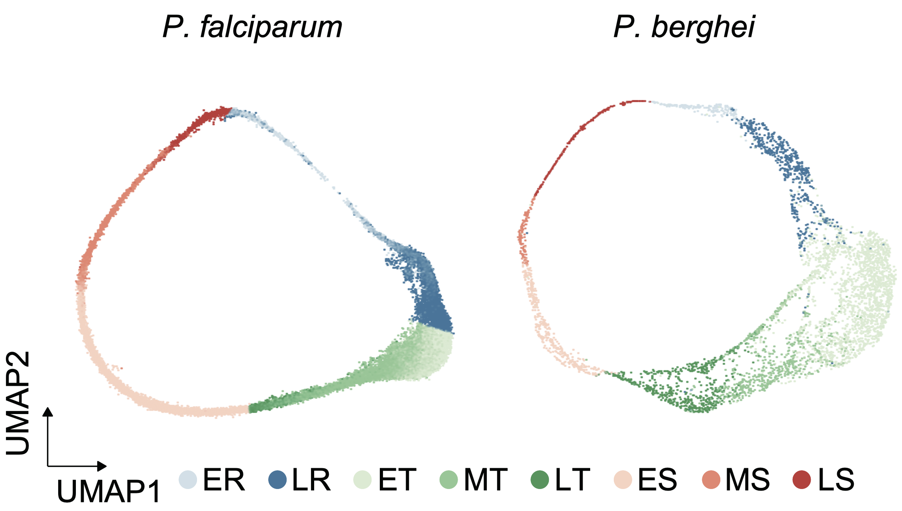

# Malaria Lipid Metabolism Analysis & MRS R Package

This repository includes:

1. 📊 **Malaria Lipid Metabolism Analysis** — A computational pipeline based on single-cell RNA-seq and bulk RNA-seq to identify conserved lipid metabolism-related genes in *Plasmodium* species and prioritize functional candidates for downstream validation.

2. 🤖 **MRS R Package** — A machine learning framework built on PU-learning (positive-unlabeled learning), designed for gene classification in datasets containing only positive samples. Includes model comparison, feature selection, and final model training.

---

## 📊 1. Malaria Lipid Metabolism Analysis

We jointly analyzed scRNA-seq data from *Plasmodium falciparum* and *Plasmodium berghei* IDC stages. A lipid metabolism gene, **CAP**, was identified and shown to regulate phosphatidylcholine and phosphatidylethanolamine biosynthesis via interaction with host CTL1.

<div align="center">
  
  <p>
  <strong>Figure 1.</strong>
  UMAP visualization of IDC-stage scRNA-seq for
  <i>P. falciparum</i> and <i>P. berghei</i>, downloaded from the
  <a href="https://www.malariacellatlas.org" target="_blank">Malaria Cell Atlas</a>.
</p>
</div>

### 📁 Dataset Overview

| File | Description |
|------|-------------|
| `01_01_Pb_seurat.Rds`, `01_02_Pf_seurat.Rds` | Seurat objects from [Malaria Cell Atlas](https://www.malariacellatlas.org) |
| `02_Gene_Orth_Data.xlsx` | One-to-one orthologs across *Plasmodium* species |
| `03_LipidGene.xlsx` | Annotated lipid metabolism-related genes |
| `04_RF_GeneInfo.xlsx` | Features for RF model |
| `05_raw_counts.txt` | Bulk RNA-seq raw counts for CAP knockout |

### 📜 Key Scripts

| Script | Description |
|--------|-------------|
| `01_Scmap_Related_Fig1.Rmd` | Cell type/stage assignment using [scmap](https://www.nature.com/articles/nmeth.4644) |
| `02_Expression_LipidGene_Related_FigS1.Rmd` | Gene expression heatmap using [ComplexHeatmap](https://academic.oup.com/bioinformatics/article/32/18/2847/1743594) |
| `03_Mfuzz_Related_Fig1.Rmd` | Temporal clustering with [Mfuzz](https://www.ncbi.nlm.nih.gov/pmc/articles/PMC2139991/) |
| `04_Randomforest_Related_Fig1.Rmd` | Lipid gene prediction via Random Forest |
| `05_DESeq2_Related_Fig3.Rmd` | DE analysis of CAP knockout using [DESeq2](https://genomebiology.biomedcentral.com/articles/10.1186/s13059-014-0550-8) |

---

## 🤖 2. MRS: Metabolism-Related Score Model

MRS is a machine learning package built on [`caret`](https://github.com/topepo/caret), designed for binary classification problems where only **positive samples** are available.

It implements a **Spy PU-learning** pipeline to identify reliable negatives, compares 10 classifiers, supports ablation-based feature selection, and provides end-to-end model evaluation.

<div align="center">
  
  <p><strong>Figure 2.</strong> Workflow of the MRS package for Spy PU-learning-based gene classification.</p>
</div>


### ⚙️ Key Features

- Spy PU-learning with tunable parameters
- Model comparison (XGBoost, RF, SVM, etc.)
- Feature selection via ablation (optional)
- Final model tuning + performance visualization

## 🚀 Getting Started

```r
# Install from source
devtools::install_local("MRS_1.0.0.tar.gz")

# Step 1: Prepare data
prep <- Prepare_classification_data(my_data)

# Step 2 (optional): PU-learning
pu_data <- Identify_reliable_negatives(prep$trainData, spy_ratio = 0.3, threshold_quantile = 0.05)

# Step 3: Train and compare models
models <- Train_multiple_models(prepared_data = prep)

# Step 4: Evaluate training performance
train_eval <- Evaluate_train_performance(models, prepared_data = prep)

# Step 5: Evaluate test performance
test_eval <- Evaluate_test_performance(models, prepared_data = prep)

# Step 6 (optional): Feature selection
fs_result <- Feature_selection_ablation(prepared_data = prep, model_name = "XGBoost")

# Step 7: Final tuning
final_model <- Tune_model_eval("XGBoost", prepared_data = fs_result)

# Step 8: Plotting
# PR Curve
Plot_pr_curves(final_model$train_pr_list, final_model$test_pr, title = "Precision-Recall Curves")

# ROC Curve
Plot_roc_curves(final_model$train_roc_list, final_model$test_roc, title = "ROC Curves")
```

---

## 📚 References

1. **Howick VM**, Russell AJC, Andrews T, Heaton H, Reid AJ, Natarajan K, Butungi H, Metcalf T, Verzier LH, Rayner JC, Berriman M, Herren JK, Billker O, Hemberg M, Talman AM, Lawniczak MKN. (2019). *The Malaria Cell Atlas: Single parasite transcriptomes across the complete Plasmodium life cycle*. **Science**, 365(6455):eaaw2619. https://doi.org/10.1126/science.aaw2619

2. **Kuhn M.** (2008). *Building Predictive Models in R Using the caret Package*. **Journal of Statistical Software**, 28(5), 1–26. https://doi.org/10.18637/jss.v028.i05

3. **Li X.** and **Liu B.** (2003). *Learning to classify texts using positive and unlabeled data*. In *Proceedings of the 18th International Joint Conference on Artificial Intelligence (IJCAI'03)*, Acapulco, Mexico, pp. 587–592.

4. **Liu B.**, **Dai Y.**, **Li X.**, **Lee W.S.**, and **Yu P.S.** (2003). *Building text classifiers using positive and unlabeled examples*. In *Proceedings of the Third IEEE International Conference on Data Mining (ICDM)*, pp. 179–186. https://doi.org/10.1109/ICDM.2003.1250918


## 🔗 Cite This Repository

If you use the **Malaria Lipid Metabolism Analysis** pipeline or the **MRS** R package in your work, please cite this repository:

> This repository accompanies a manuscript currently under peer review. Citation details will be updated upon publication.

